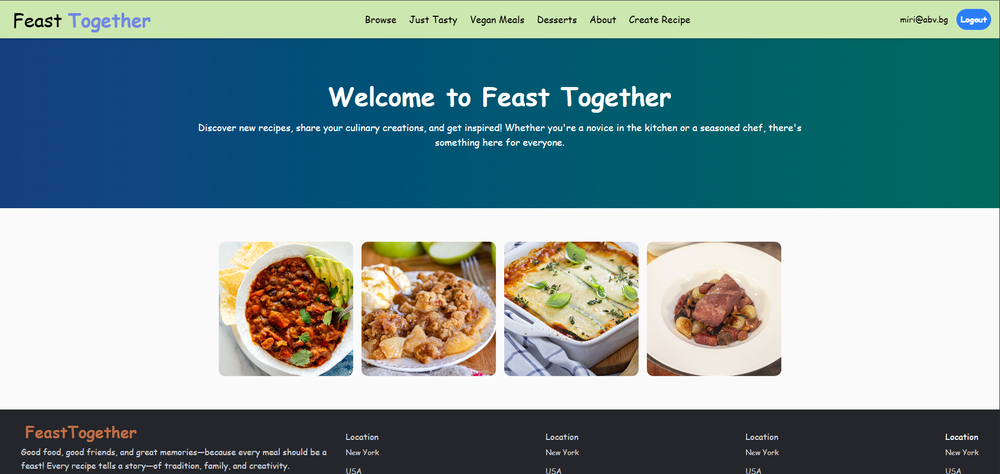
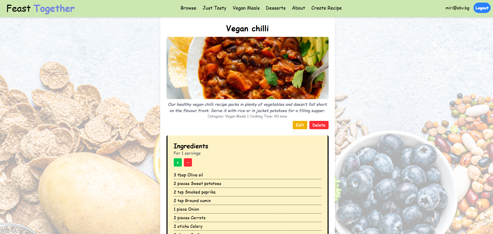
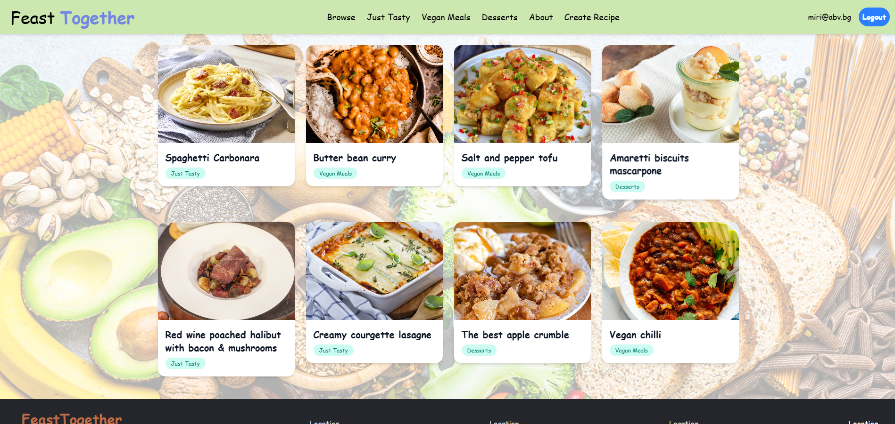
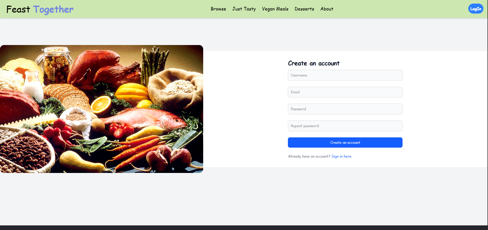

# FeastTogether - recipe application

# Recipe App

A recipe-sharing application built with React for the frontend, Express.js for the backend, and MongoDB for database management. 

This app allows users to browse recipes, create and submit new recipes, vote on recipes, and comment on them. 

Guests can browse the recipes and register an account. 

## Features

- **Guest Users:**
  - Browse recipes.
  - View recipe details (ingredients, instructions, etc.).
  - Register for an account.

- **Authenticated Users:**
  - Create, edit, and delete their own recipes.
  - Vote on recipes.
  - Comment on recipes.
  - Adjust ingredient servings for recipes.

## Technologies Used

- **Frontend:** React 19, CSS
- **Backend:** Node.js, Express.js
- **Database:** MongoDB, Mongoose

## Installation

**Frontend**
```bash
cd client
npm install
npm run dev
```
**Backend**
```bash
cd server
npm install
npm run dev
```

### Prerequisites

- MongoDB (running locally)

---

# Screenshots

## HOME PAGE



## DETAILS



## BROWSE RECIPES



## REGISTER



